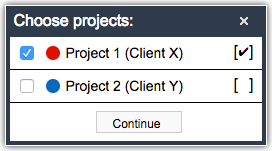

# Toggl Import

Chrome extension for importing a single day from toggl to soncoso daily time record.

## Installation

- Clone this repository
- Open Chrome and navigate to "chrome://extensions"
- Enable the developer mode
- Press "Load unpacked extension..." and select the extension folder (containing the manifest.json)

- You should now see the extension in the list
- You can disable the developer mode now
- You can press "Update" to reload the extension on updates

## Setup

- Go to toggl and open your profile settings

- Scroll down to API key and copy it

- Open the extension popup
- Paste the API key
- Press update to get your workspace id

- Additionally there's the option to automatically import all time entries for a day when there is only one project listed for this day.

## Usage

- Go to soncoso and start the time tracking for a single day
- On the third page (when asked to enter your time entries) an additional button for the import will appear on the bottom of the dialog
- Press it to start the import

- After the time entries for the selected day have been loaded you will be asked to select all projects to import
- The right checkbox offers the possibility to include the project name as a prefix for the description of all related entries (e.g. `[Project 1] Ticket 1`), this option will be saved and automatically set in further imports

- After pressing continue all time entries for the selected projects will be added to the list

- You can continue the time tracking as usual

### Automatic import

## Changelog

### 1.1.0

- Added semi-automatic import functionality for a complete project

### 1.0.3

- Added support for project prefix for time entries

### 1.0.2

- Added direct import for a single day if only one project is available

### 1.0.1

- Bug fixes

### 1.0.0

- Initial project
